# 杭工e家app地铁券

本人不是专业的,只是靠着ai学习,如有误还望大佬指出

## fiddler抓取雷电模拟器手机的包

### 1. 配置fiddler

#### 1.1 导出CA证书

HTTPS--这个几个勾上,然后Actions选择Export to desktop把ca证书导出到桌面

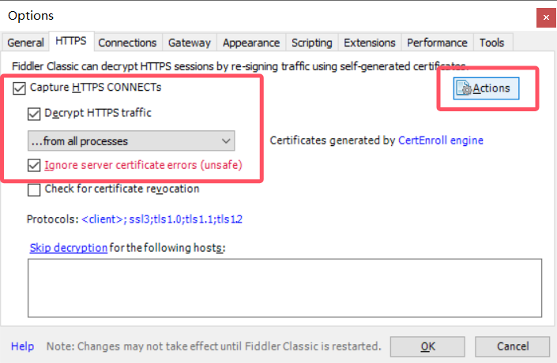

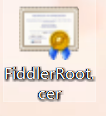

双击安装证书---当前用户----将所有证书放入下列存储(受信任的)--完成

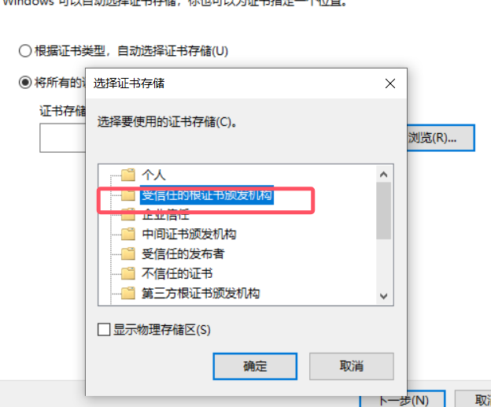

#### 1.2 配置fiddler允许远程连接

connections--勾选Allow remote computers to connect  开启远程连接监控,端口是8888

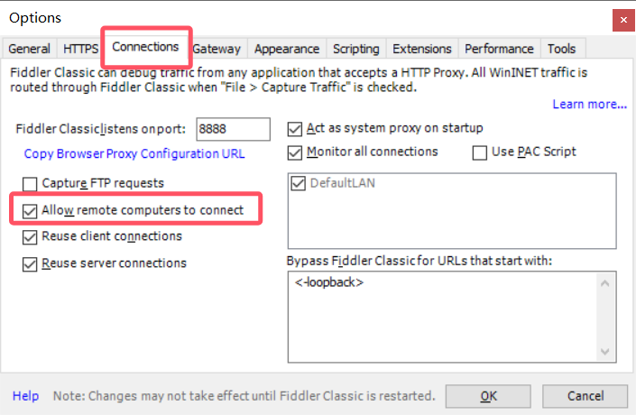

### 2 模拟器参数配置

电脑打开cmd,输入`ipconfig`查看自己的ipv4地址

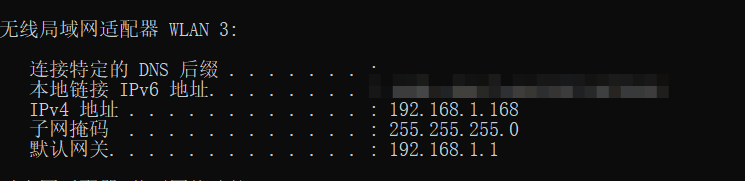

打开模拟器浏览器输入`http://192.168.1.168:8888`可以看到这样的界面,点击下方下载证书

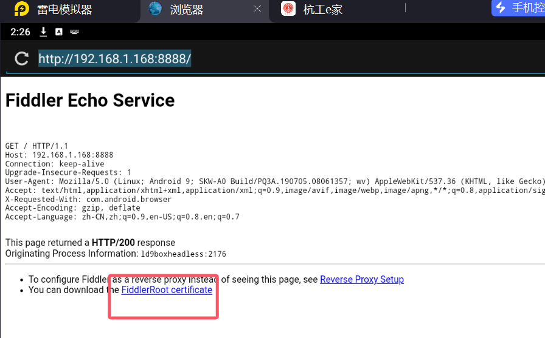

直接浏览器下载打开安装,设置名称为fiddler.途中会让你设置一个锁屏密码


设置连接的wifi代理,主机名就是你的ipv4地址,端口号就是8888

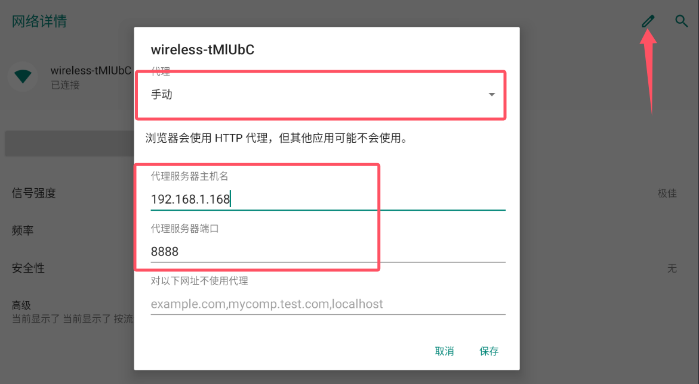

保存后我们打开一些应用,在fiddler中可以看到抓包信息,ld9box就是雷电模拟器9发出的http,这个hzgh应该是我打开的杭工e家app

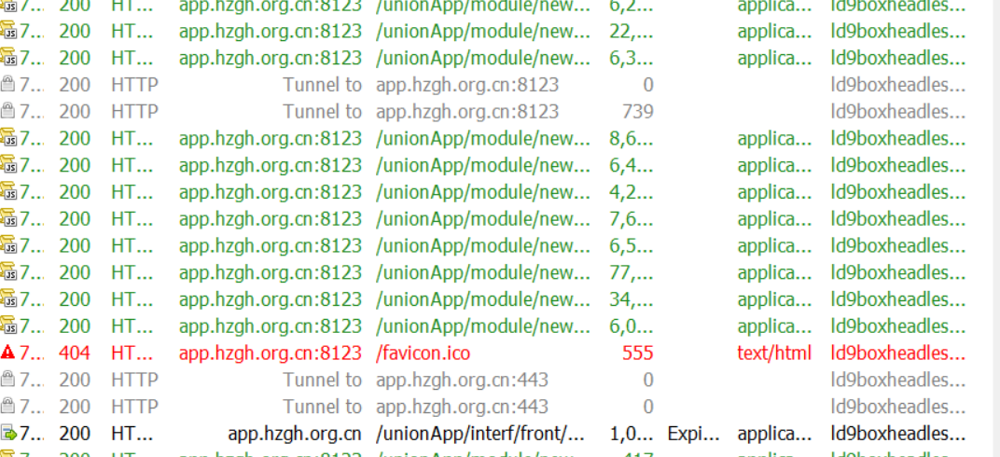

能够抓到包了,但是不知道怎么弄优惠券


## 3.抓包抢券的接口

此时我点击抢优惠券,发出的请求是这个

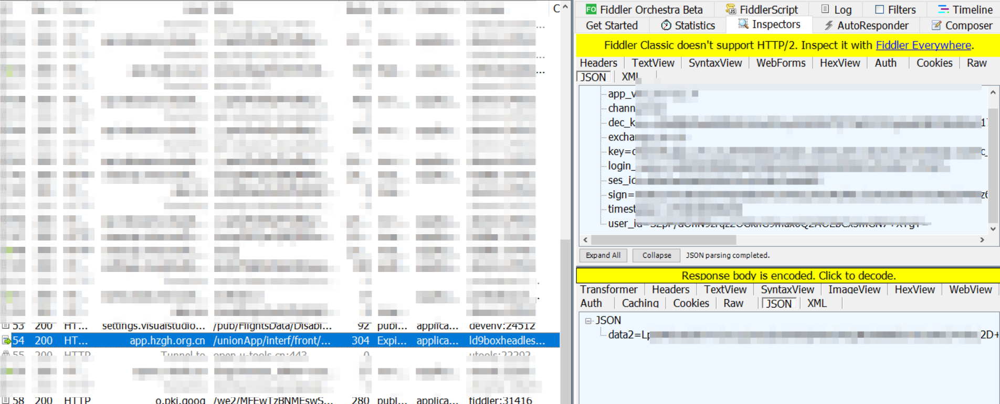

右击save---Selected sessions --save as text   把整个数据包导出

- `timestamp`: 每次点击都不同，且是一个 **毫秒级时间戳**（不过你的时间戳值在 1754... 这个年份级别，应该是被加偏移或做了时间混淆处理）
- `login_name` / `user_id`: 看起来是相同值，但都是一串 **Base64 编码后再加密** 的密文
- `dec_key`: 每次不同，很可能是前端用某种公钥算法生成的会话密钥
- `sign`: 每次不同，是根据 key 列表里这些字段做的数字签名


# 5 解密

下载`jadx`放入app逆向,根据之前进入抢票界面会404,推测app是直接拉了一个网页来展示,并且在里边搜索OL41,dec_key 都没有找到,但是搜索`loadUrl`能够查询到一堆,也更加肯定了我的推测

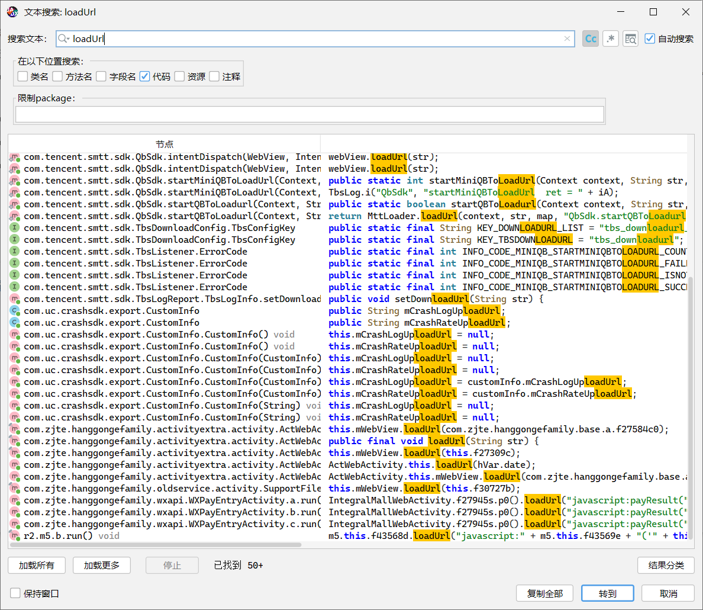

#### 5.1 先找到入口 Activity


在模拟器里点进**抢券页面**，同时打开`cmd`输入`adb shell dumpsys activity activities | findstr mResumedActivity`,用 **adb** 看当前界面所属的 Activity：

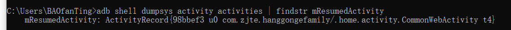

可以看到`com.zjte.hanggongefamily/.home.acitvity.CommonWebActivity t4`,`com.zjte.hanggongefamily` 是包名,`.home.acitvity.CommonWebActivity t4` 是类名,我们就需要这个类名,这说明抢券页面确实是用 **WebView 打开网页** 的，不是原生界面。

打开`jadx`,进入这个路径`com.zjte.hanggongefamily/home/acitvity/CommonWebActivity`,但是这个类确实只是一个 **通用 WebView 容器**,它用 `getIntent().getStringExtra("url")` 拿到一个 URL,然后直接 `webView.loadUrl(url)`,没有任何和 `OL41`、`sign`、`dec_key` 相关的加密逻辑,所以抢券的请求一定是 **网页里的 JavaScript 发出去的**，而不是这个 Java 类本地构造的

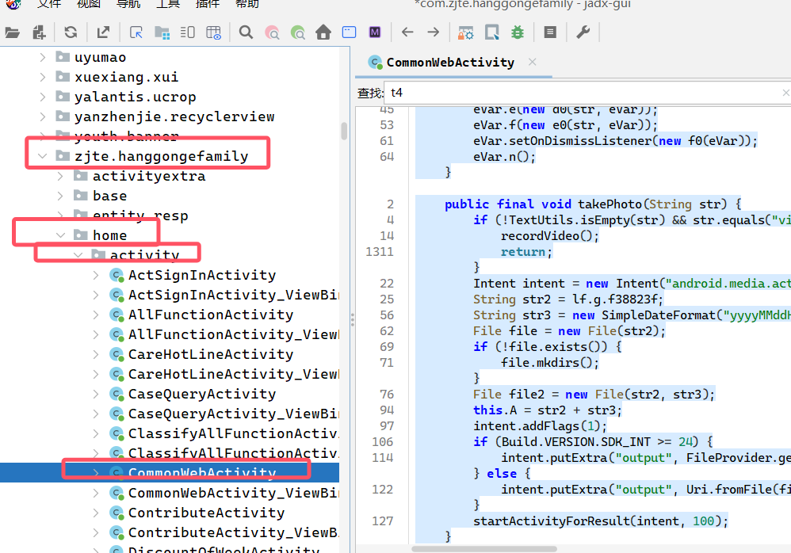

我们需要找到`new Intent(, CommonWebActivity.class)`,是谁启动了`CommonWebActivity`并传入了url,但是搜索出来有好多

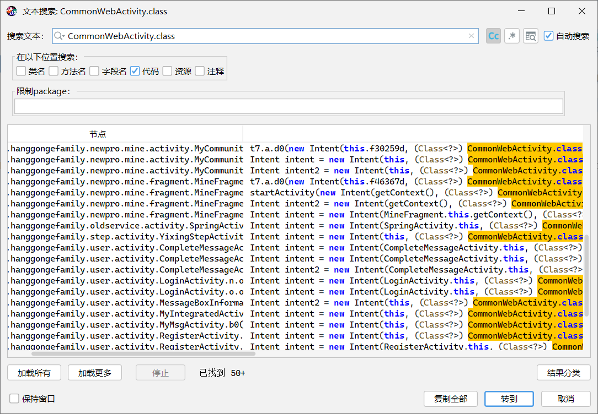


## 5.2 找到.js

点击进入抢4元优惠券的界面和加载了这几个js,尝试获取他们产看,在fiddler右键 → Save → Response → Response Body,下载js文件

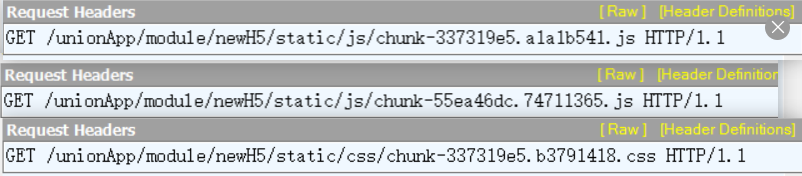

打开发现是乱码的,点击fiddler,点击这里编码后,能够在软件里查看,再次导出js,能够查看到数据

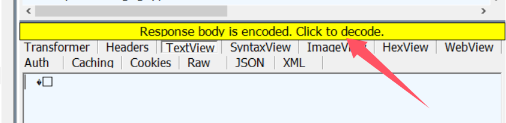

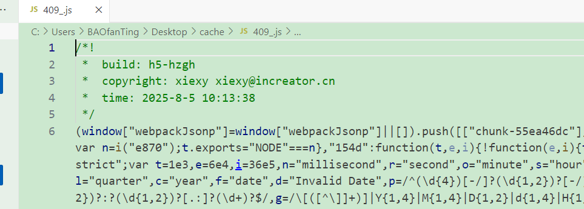

此时打开查找,搜索兑换,可以看到有了,我们应该是找到了正确的js文件,是`chunk-337319a5.alalb541.js`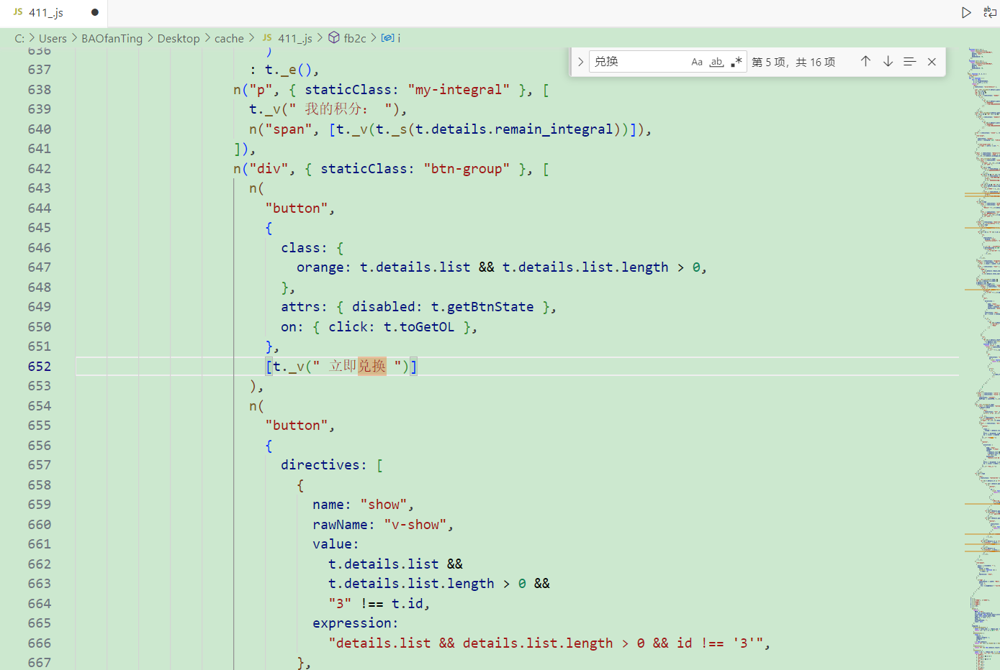

ai分析一波

**OL41 接口调用位置**

- 在模块 `ec15` 里：

  ```
  js复制编辑function C(t = {}) {
      return Object(i["a"])({
          url: "/interf/front/OL/OL41",
          method: "post",
          data: t,
          handleCatch: !0
      });
  }
  ```

  也就是 `r["i"]`、`r["j"]`、`r["C"]` 等形式调用时，实际上会走到这个 OL41 请求。

**调用 OL41 的业务逻辑**

- 在组件的 `methods.toGetOL()` 里：

  ```
  js
  
  复制编辑
  Object(r["j"])({ exchange_id: this.id })
  ```

  这里的 `r["j"]` 就是 `/OL/OL42`，但获取活动信息 `fetchActivityOLInfo()` 调的是 `r["i"]`（`OL41`），所以 OL41 主要是获取详情，OL42 才是提交兑换。

**没有 sign/dec_key 生成逻辑**

- 在这个文件里没有 `CryptoJS`、`sign`、`dec_key` 的生成逻辑，说明这些加密参数是在 **`b775` 模块** 里统一封装的（`Object(i["a"])` 就是从 b775 引来的）。
- 也就是说，你得去 `b775` 里找全局请求封装函数，那里会在 `data` 之外额外加上加密字段。

**这个 JS 是 H5 页面**

- 这个组件是 Vue 单文件编译出来的，运行在 WebView 里（`CommonWebActivity` 打开了这个 H5）。
- 所以 OL41、OL42 请求和加密逻辑全都发生在 H5 JS 里，不在原生 App 代码中。


重点是找到这个`b775`,加载抢券界面的时候没有这个b775,那只能在开启程序的时候有了吧,我们在前边搜索,一直成功找到两个个文件包含`b775`.

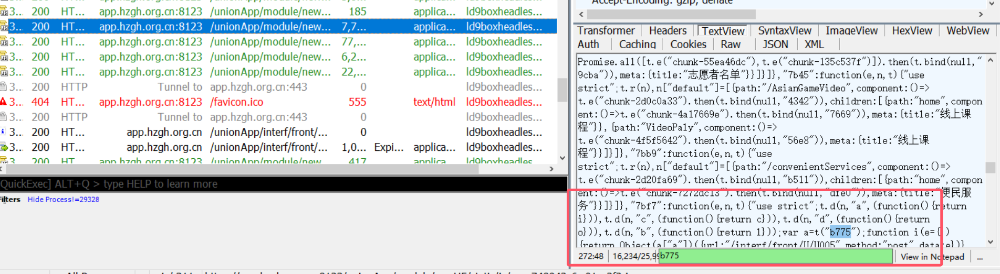

最终在`app-ea1f58e8.825614f8.js`这里找到了`b775`的函数定义,并且在函数里有相关的加密信息

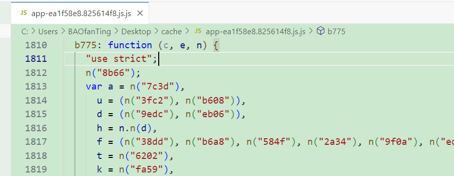

#### 1. 加密相关工具（`A` 对象）

- `encrypt(c)`：用 SM2 公钥加密数据 `c`。
- `decrypt(c)`：用 SM2 私钥解密数据 `c`。
- `getSign(c)`：对数据 `c` 进行 SM2 签名（hash 和 DER 格式）。
- `verifySign(c, e)`：验证 SM2 签名。

#### 2. 重要密钥和参数

- `v`, `w`：SM2 的私钥和公钥（十六进制字符串）。
- `publicKey`, `privateKey`：RSA 公私钥，做签名验签用。
- `encryptKeys`：需要对请求参数进行对称加密的字段列表。
- `noSignKeys`：不参与签名的字段。
- `signkey`, `signNewKey`：用于签名的密钥。

#### 3. 对称加密函数

- `O(c, e)`：使用 3DES ECB 模式对字符串 `e` 用密钥 `c` 进行加密，返回密文字符串。
- `j(c, e, n)`：3DES CBC 模式解密函数，用 `c` 做 key，`e` 作为 iv 解密密文 `n`。

#### 4. 签名函数 `B(c)`

- 使用 RSA 私钥对字符串 `c` 进行 SHA256withRSA 签名，输出 base64 格式的签名。

#### 5. 随机字符串生成 `I(c, e, n)`

- 生成长度随机（或固定长度）的字符串，包含数字和大小写字母。

#### 6. 加密和签名流程 `_encryptAndSign`

- 合并公共参数和业务参数。
- 根据版本和渠道选择 RSA 公钥。
- 生成随机密钥 `m`，用 RSA 公钥加密该密钥，存为 `dec_key`。
- 对请求中指定字段（`encryptKeys` 或 `JSONServletEncryptKeys`）用 3DES 对称加密（密钥为 `m`）。
- 生成签名：拼接参数值（除不签名字段）进行签名。
- 返回处理后的数据对象。

#### 7. SM2 加密和签名流程 `_encryptAndSign_SM`

- 通过 SM2 对部分参数和请求头字段加密。
- 返回包含请求头、请求体和签名的对象。

#### 8. 解密 `_decrypt`

- 用 RSA 私钥解密数据。
- 进一步用 3DES CBC 解密实际数据。
- 返回解密后的 JSON 对象。


## 5.3 搭建请求

让ai修改代码,`SES_ID`就是之前抓包的一直不变的,`login_name`和`user_id`需要获取到明文

```python
import requests
import time
import random
import string
import base64
import hashlib
from Crypto.Cipher import DES3, PKCS1_v1_5
from Crypto.PublicKey import RSA

# ================= 配置区域 =================
PUBLIC_KEY_PEM = """-----BEGIN PUBLIC KEY-----
MIGfMA0GCSqGSIb3DQEBAQUAA4GNADCBiQKBgQCVXsxrrMcxNwFNYt0wMTdqc5WMa4gr7nMbWbcQCpJ2XNBMTQetknYNzCr8MMRdHBKFKjdCJE40u6UDBXQx13z7OSKyvQBwtLj5n8eIQXRtpMIjvqfR1xRuNBi5147ZXJDbKxWGRm0kjLN5UuqnDe6zu8v6MKU7KNDzHUrWqsj2LwIDAQAB
-----END PUBLIC KEY-----"""

SIGN_KEY = "qwerqaz.-*"   # b775 里用的固定 signkey
ENCRYPT_KEYS = ["login_name", "user_id"]  # 需要 3DES 加密的字段
SES_ID = "你的sesid"
LOGIN_NAME_PLAINTEXT = "你的login_name明文"
USER_ID_PLAINTEXT = "你的user_id明文"

URL = "https://app.hzgh.org.cn/unionApp/interf/front/OL/OL41"
# ============================================


def random_str(length):
    """生成随机字符串"""
    chars = string.ascii_letters + string.digits
    return ''.join(random.choice(chars) for _ in range(length))


def rsa_encrypt(pub_key_pem, plaintext):
    """RSA 公钥加密"""
    rsakey = RSA.importKey(pub_key_pem)
    cipher = PKCS1_v1_5.new(rsakey)
    return base64.b64encode(cipher.encrypt(plaintext.encode())).decode()


def triple_des_encrypt(key, plaintext):
    """3DES ECB PKCS7 加密"""
    # 3DES 要求 key 长度是 24 字节
    key_bytes = key.encode()
    cipher = DES3.new(key_bytes, DES3.MODE_ECB)
    pad_len = 8 - len(plaintext) % 8
    padded = plaintext + chr(pad_len) * pad_len
    return base64.b64encode(cipher.encrypt(padded.encode())).decode()


def build_payload():
    # 1. 生成随机 24 位 m
    m = random_str(24)

    # 2. RSA 加密得到 dec_key
    dec_key = rsa_encrypt(PUBLIC_KEY_PEM, m)

    # 3. 构建数据字典
    data = {
        "channel": "02",
        "app_ver_no": "3.1.4",
        "timestamp": int(time.time() * 1000),
        "login_name": LOGIN_NAME_PLAINTEXT,
        "user_id": USER_ID_PLAINTEXT,
        "ses_id": SES_ID,
        "exchange_id": "10",
        "dec_key": dec_key
    }

    # 4. 对 encryptKeys 列表内的字段用 3DES 加密
    for k in ENCRYPT_KEYS:
        if data.get(k):
            data[k] = triple_des_encrypt(m, data[k])

    # 5. 生成 key 字段
    data["key"] = ",".join(data.keys())

    # 6. 生成 sign
    sign_str = "".join(str(data[k]) for k in data if k != "sign") + SIGN_KEY
    md5_val = hashlib.md5(sign_str.encode()).hexdigest().upper()
    sha256_val = hashlib.sha256(md5_val.encode()).hexdigest().upper()
    data["sign"] = sha256_val

    return data


def main():
    headers = {
        "Host": "app.hzgh.org.cn",
        "Connection": "keep-alive",
        "Accept": "application/json, text/plain, */*",
        "User-Agent": "Mozilla/5.0 (Linux; Android 9; SKW-A0 Build/PQ3A.190705.08061357; wv) "
                      "AppleWebKit/537.36 (KHTML, like Gecko) Version/4.0 Chrome/91.0.4472.114 "
                      "Safari/537.36;unionApp;HZGH",
        "Content-Type": "application/json;charset=UTF-8",
        "Origin": "https://app.hzgh.org.cn:8123",
        "X-Requested-With": "com.zjte.hanggongefamily",
        "Referer": "https://app.hzgh.org.cn:8123/",
        "Accept-Encoding": "gzip, deflate",
        "Accept-Language": "zh-CN,zh;q=0.9,en-US;q=0.8,en;q=0.7"
    }

    payload = build_payload()
    print("请求数据:", payload)

    resp = requests.post(URL, headers=headers, json=payload, verify=False)
    print("状态码:", resp.status_code)
    print("响应:", resp.text)


if __name__ == "__main__":
    main()

```

## 5.4`login_name`和`user_id`明文获取

目前还没有找到,直接输我的**手机号**了,运行程序报错,发现Python 直接请求目标 HTTPS 时 TLS 握手失败,于是通过Fiddler在手机app上发起请求

```pyhton
#让python通过fiddler走手机的通道发起请求
    proxies = {
        "http": "http://127.0.0.1:8888",
        "https": "http://127.0.0.1:8888"
    }
    
    resp = requests.post(URL, headers=headers, json=payload, verify=False, proxies=proxies)
```


# 6 运行程序

成功运行了,而且可以看到收到的回复和之前,直接拿点击按钮抓包发送的请求的回应差不多,就等到点测试了

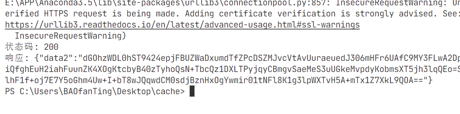

