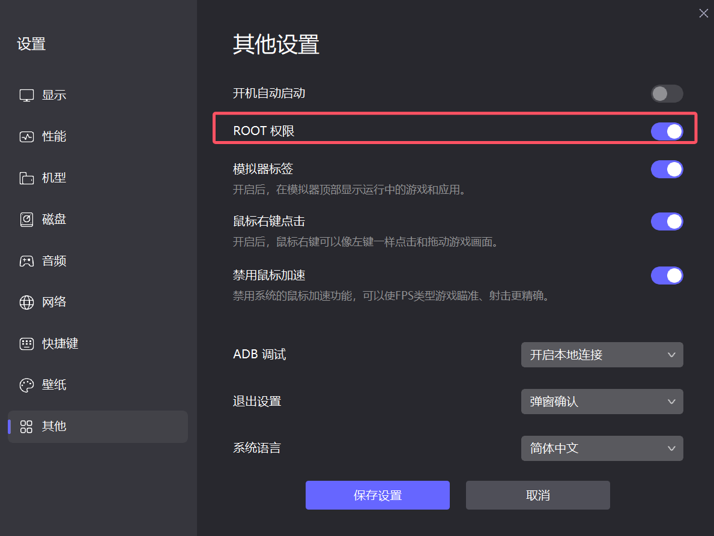
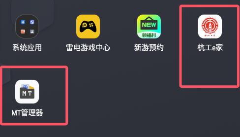
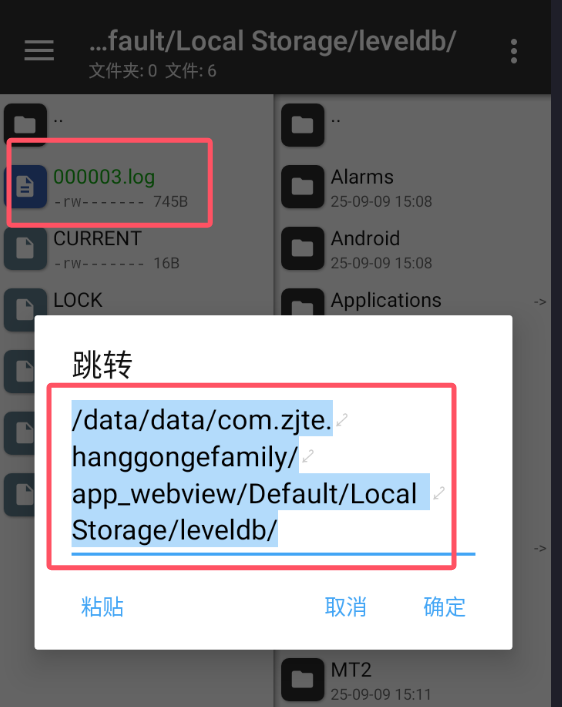

# 杭工e家自动化脚本项目


## 📖 项目简介

这是一个用于杭工e家APP的自动化脚本项目，支持多种功能包括签到、评论、查询积分、兑换优惠券等。项目提供 **Python** 和 **JavaScript** 两个版本，具有完整的加密解密、错误处理、重试机制和钉钉通知功能。

## 🚀 版本选择

### 🐍 Python 版本
- **特点**: 图形界面，操作简单，适合初学者
- **优势**: 可视化配置，一键运行
- **适用场景**: 个人使用，手动操作

### ⚡ JavaScript 版本  
- **特点**: 命令行运行，性能更优，支持持续请求
- **优势**: 执行速度快，资源占用少，支持自动化部署
- **适用场景**: 服务器部署，定时任务，批量操作

## 📁 项目结构

```
AutoTicket/
├── README.md                    # 项目总览（本文件）
├── AutoTicket.py               # Python版本主程序
├── Decoder.py                  # Python版本解密模块
├── gui.py                      # Python版本图形界面
├── updater.py                  # Python版本更新器
├── requirements.txt            # Python依赖
├── JavaScript_Version/         # JavaScript版本目录
│   ├── README.md              # JavaScript版本总览
│   ├── README_快速开始.md      # JavaScript快速上手指南
│   ├── README_项目总览.md      # JavaScript详细文档
│   ├── README_技术架构.md      # JavaScript技术实现
│   ├── AutoTicket.js          # JavaScript主程序
│   ├── workflow_sigin.js      # 工作流脚本
│   ├── decrypt.js             # 解密模块
│   ├── encrypt_rsa.js         # 加密模块
│   ├── workflow_config.js     # 配置文件
│   └── dingtalk_config.js     # 钉钉配置
└── image/                     # 项目截图
```

## 🎯 功能特性

- ✅ **完整工作流**: 自动执行签到、评论、查询积分
- ✅ **智能重试**: 自动重试失败请求，支持多种错误类型
- ✅ **持续请求**: JavaScript版本支持持续请求直到成功
- ✅ **加密安全**: 完整的RSA+DESede加密解密
- ✅ **钉钉通知**: 实时推送执行结果
- ✅ **性能监控**: 详细的执行时间和重试统计
- ✅ **配置统一**: 集中管理所有配置参数
- ✅ **错误处理**: 完善的错误处理和日志记录

## 🚀 快速开始

### Python 版本
1. 下载并安装 [雷电模拟器](https://www.ldmnq.com/#page2)
2. 安装杭工e家APP和MT管理器
3. 获取 `login_name` 和 `ses_id`（详见下方获取方法）
4. 运行 `AutoTicket.py`，填入信息即可使用

### JavaScript 版本
1. 安装 Node.js (建议 v14+)
2. 进入 `JavaScript_Version` 目录
3. 运行 `npm install` 安装依赖
4. 配置钉钉机器人和用户信息
5. 运行 `node AutoTicket.js` 开始使用

**详细操作指南**：
- [Python版本操作指南](#python版本操作指南)
- [JavaScript版本操作指南](#javascript版本操作指南)

## 📋 获取必要参数

# 运行流程


打开模拟器按下边操作,得到自己的`SES_ID`，`LOGIN_NAME_PLAINTEXT` ,下载软件打开填入,修改时间运行

## 1 模拟器配置


下载雷电模拟器https://www.ldmnq.com/#page2,打开雷电模拟器设置--其他设置--开启root权限[](https://camo.githubusercontent.com/70b1444e8eb63acca83a711ef74731bb8682903efecc1da24f981ce08669262d/68747470733a2f2f67697465652e636f6d2f62616f66616e74696e672f696d6167652f7261772f6d61737465722f696d6167652f32303235303930393135333130383135312e706e67)

安装杭工e家app和Mt管理器

[](https://camo.githubusercontent.com/930d08e17be03b43be985247452f5cf6d6e71fee66a618e948a3dcf1d407dbbd/68747470733a2f2f67697465652e636f6d2f62616f66616e74696e672f696d6167652f7261772f6d61737465722f696d6167652f32303235303930393135333130383135322e706e67)

## 2 `login_name`，`ses_id`获取


在模拟器上登录杭工e家,登录后点开积分优享,且界面加载

[](https://camo.githubusercontent.com/74837c700b79a52cf3f8d9bccd46e02ca23513a557964d042a38864d48678702/68747470733a2f2f67697465652e636f6d2f62616f66616e74696e672f696d6167652f7261772f6d61737465722f696d6167652f32303235303930393135333130383135332e706e67)

`mt管理器`打开路径 `/data/data/com.zjte.hanggongefamily/app_webview/Default/Local Storage/leveldb/`能够看到有个log文件,他就是我们需要的

[](https://camo.githubusercontent.com/39917199296a465b067bdabfc5e4da17fd5b4adf85ee0dd722c22791358c42e1/68747470733a2f2f67697465652e636f6d2f62616f66616e74696e672f696d6167652f7261772f6d61737465722f696d6167652f32303235303930393135333130383135352e706e67)

打开滑动到最下边,复制最后的 `login_name`，`ses_id`,填入程序

[

双击运行软件,填入信息,修改时间运行,出现手慢优惠券没了,说明正确. 修改为抢票时间点击启动等待即可

[

## 📚 详细文档

### Python 版本
- **主程序**: `AutoTicket.py` - 图形界面主程序
- **解密模块**: `Decoder.py` - 响应数据解密
- **图形界面**: `gui.py` - 用户界面
- **更新器**: `updater.py` - 自动更新功能

### JavaScript 版本
- **[快速开始指南](./JavaScript_Version/README_快速开始.md)** - 5分钟快速上手指南
- **[项目总览](./JavaScript_Version/README_项目总览.md)** - 完整项目文档和使用说明
- **[技术架构](./JavaScript_Version/README_技术架构.md)** - 系统架构和技术实现

## 🎨 界面展示

### Python 版本界面


### JavaScript 版本运行效果

### 钉钉通知效果
- **签到推送**: 
- **留言推送**: 
- **兑换推送**: 

## ⚠️ 注意事项

1. **登录状态**: 在手机登录杭工e家后，模拟器会退出登录，需要重新登录
2. **参数更新**: 每次重新登录后需要重新获取 `ses_id`
3. **使用频率**: 避免过于频繁的请求，遵守服务器限制
4. **法律声明**: 本项目仅供学习和研究使用，请遵守相关法律法规

## 🔧 技术栈

### Python 版本
- **Python 3.x**: 主要开发语言
- **tkinter**: 图形界面
- **requests**: HTTP请求
- **cryptography**: 加密解密

### JavaScript 版本
- **Node.js**: 运行时环境
- **crypto**: 加密解密模块
- **node-rsa**: RSA加密库
- **https**: HTTP请求模块

## 📞 支持与反馈

如有问题或建议，请：
1. 查看对应版本的详细文档
2. 检查配置参数是否正确
3. 查看控制台错误日志
4. 提交 Issue 反馈问题

## 📄 许可证

本项目基于 MIT 许可证开源。详见 [LICENSE](./LICENSE) 文件。

---

**免责声明**: 本项目仅供学习和研究使用，请遵守相关法律法规和网站使用条款。如他人使用本仓库代码用于商业用途，侵犯到杭工e家等，本人不承担任何责任。

[](https://www.star-history.com/#BAOfanTing/AutoTicket&Date)