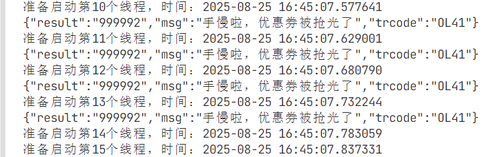

# 参数配置

python版本3.9,只需要设置框选这几个参数即可,其中 `login_name`和 `user_id`是一样的,且不会变.

你只需要获取到下边框选 `ses_id,login_name,user_id`的就可以跑代码了

**你获取到了ses_id,login_name,user_id,再要代码**

`PUBLIC_KEY_PEM` 公钥,抓包获取,应该大家都一样

`SES_ID` =  抓包得到的id,也可模拟器本地文件查看获取,重新登录后ses_id会变化

`LOGIN_NAME_PLAINTEXT` = 模拟器本地文件查看获取

`USER_ID_PLAINTEXT` = 模拟器本地文件查看获取

`exchange_id`  9是2块地铁券  10是4块地铁券   11是6块地铁券

`RUN_TIME` = datetime(2025, 8, 19, 17, 00, 1, 500000)   运行的时间   建议只修改小时和分钟

`RUN_COUNT` = 50        # 运行次数 建议默认

# 运行流程

配置好fiddler与模拟器(模拟器打不打开都行)---打开fiddler----启动程序,得到手慢了,优惠券被抢完了  ,说明步骤对了,设置时间等待程序启动即可

## 注意事项

模拟器退出登录后,重新登录,打开fiddler,点击积分兑换界面,这样本地才能更新ses_id,此时再打开获取

# fiddler抓取雷电模拟器手机的包

# 1. 配置fiddler

## 1.1 配置fiddler允许远程连接

下载fiddlerhttps://secure.singdown.com/win/4422/458942.html?f=bdj_1493713

connections--勾选Allow remote computers to connect  开启远程连接监控,端口是8888

## 1.2 导出CA证书

设置--HTTPS--这个几个勾上,然后Actions选择Export to desktop把ca证书导出到桌面

双击安装证书---当前用户----将所有证书放入下列存储(受信任的)--完成

也可把这个证书放入模拟器也安装上

# 2 模拟器参数配置

电脑按下 `win+R`输入 `cmd`打开cmd,输入 `ipconfig`查看自己的ipv4地址

下载雷电模拟器https://www.ldmnq.com/#page2

打开模拟器浏览器输入 `http://192.168.1.168:8888`可以看到这样的界面,点击下方下载证书(这个阶段如果模拟器网页一直加载失败,可以百度雷电模拟器配置fiddler,或者通过共享文件夹的形式把电脑上的证书复制到模拟器里安装)

直接浏览器下载打开安装,设置名称为fiddler.途中会让你设置一个锁屏密码

设置连接的wifi代理,主机名就是你的ipv4地址,端口号就是8888

保存后我们打开一些应用,在fiddler中可以看到抓包信息,ld9box就是雷电模拟器9发出的http,

下载杭工e家app安装登录 点击抢券,模拟器上点击抢券后,可以看到有一个数据包,这里能够看到你的 `ses_id`

# 3 `login_name`和 `user_id`明文获取,`ses_id`获取

打开雷电模拟器设置--其他设置--开启root权限,下载 `mt管理器`打开路径 `/data/data/com.zjte.hanggongefamily/app_webview/Default/Local Storage/leveldb/`能够看到有个log文件,他就是我们需要的

打开搜索 `login_name`,`ses_id`,复制拿出,准备填入代码

# 配置pyhton环境

自行百度,python3.9,`pip install -r requirestment.txt`安装所需库
